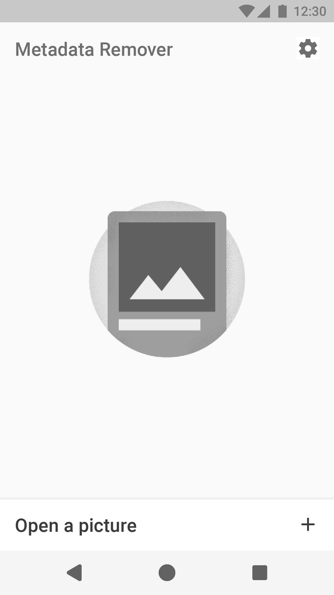
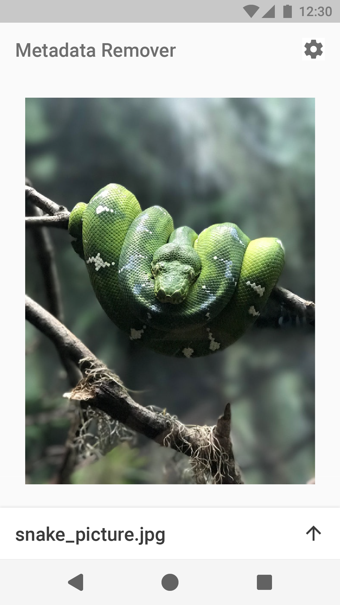
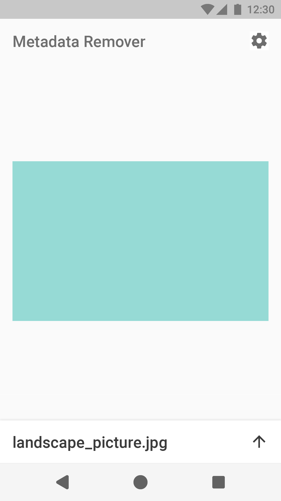
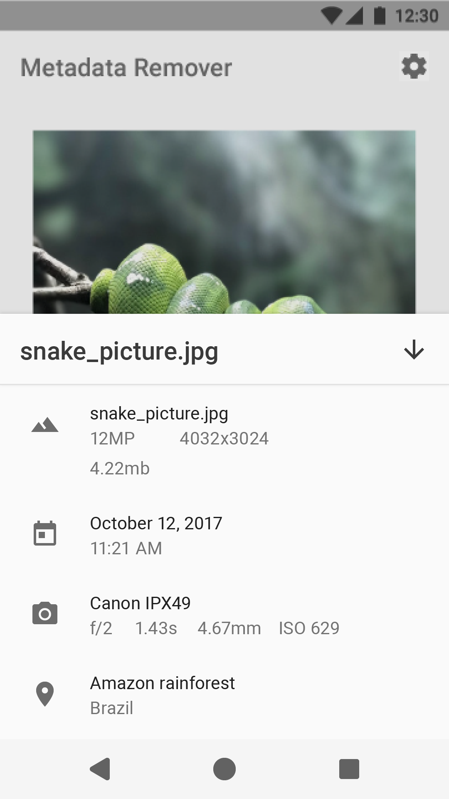
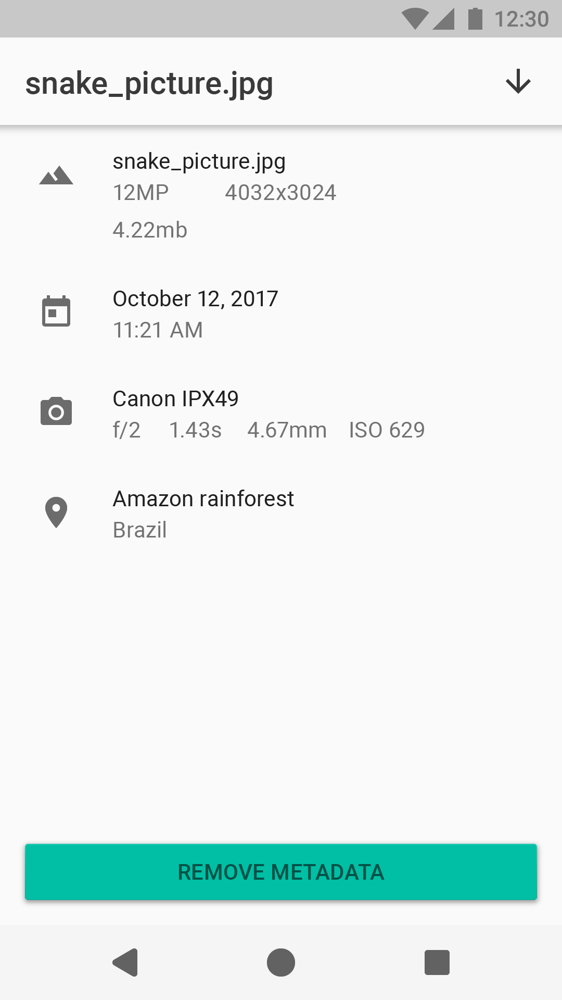
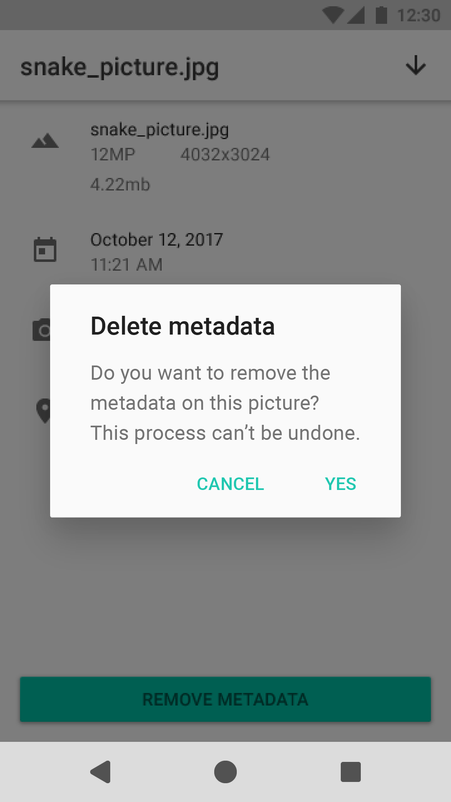
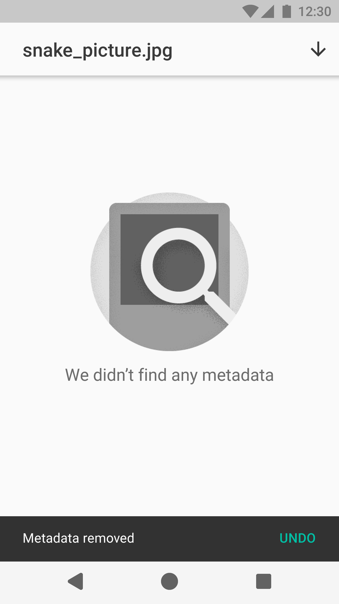
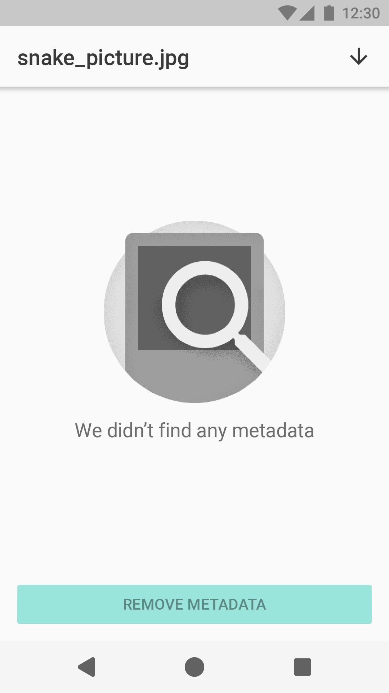
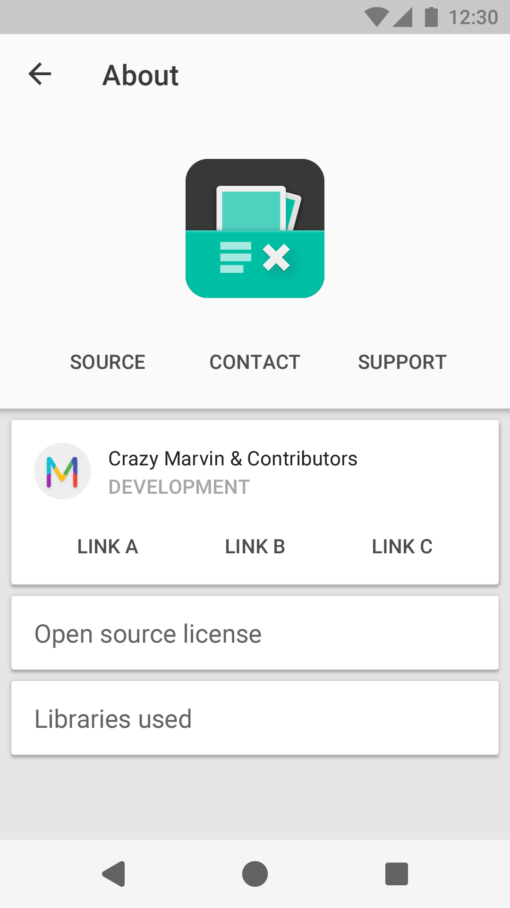

# App UI-Design Mockup

## Empty state screen

The User has opened the app and no image is loaded yet.

**Screenshot portrait**:  

## Picture preview screen

The user has selected an image and a preview is shown.

**Screenshot portrait**:  

**Screenshot landscape**:  

## Information slide

The swipes up a panel with the image's metadata.

**Screenshot portrait**:  

## Information screen

The user has opened a screen with the image's metadata.

**Screenshot portrait**:  

## Deletion dialog

The user has pressed the delete button and a brief warning appears.

**Screenshot portrait**:  

## Deletion confirmation

The user has accepted the deletion of the image's metadata
and a confirmation is shown on screen with the possibility
to undo the process.

**Screenshot portrait**:  

## Empty information screen

The user has selected an image that doesn't contain metadata or
the user has deleted the metadata of a previously loaded image.

**Screenshot portrait**:  

## About page

The user has opened the app's about screen that contains information about
the app makers.

**Screenshot portrait**:  

